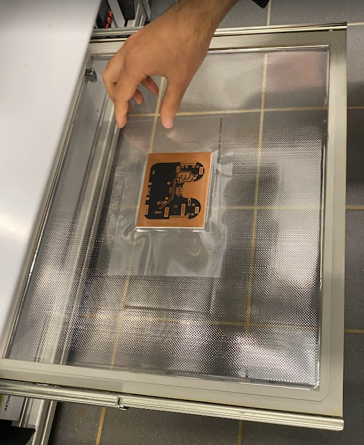
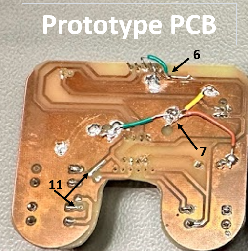

----

# PCB Compact Gameboy
 

By: *Praneel Bhatia* & *Krishang Agarwal*


Date: 6 Jan 2024

----

## 1 Abstract

The Gameboy PCB project focuses on allowing the user to play games which can be run on an ATTiny85 Microcontroller along with other necessary components mentioned in this report. The games can be controlled by the user with the help of 3 push buttons: left button; right button; and Fire/reset button. These buttons and their functionality are chosen according to the programming of the games uploaded on the ATTiny85. The games will be displayed on an OLED display appropriately connected to the ATTiny85 chip. 

We duly made all the required connections on a breadboard to prototype the end product, which was successfully functioning after a number of trials and prototypes. A 9V power supply powered the breadboard prototype. A slide switch controlled the POWER ON and POWER OFF state of the prototype.

The end product would feature a compact Gameboy designed diligently on a suitable PCB design, powered by a provenly sufficient 3V button cell, overall allowing our product to be portable and used anywhere desired by the user.

This report will show all the steps taken to get to the end-product, all the challenges that we faced in the process and their respective solutions as well.

## 2 Introduction

The evolution of portable gaming has drastically shot up ever since the release of the first Gameboy by Nintendo in 1989, which set a profound standard for on the go gaming. When looking through the eyes of Practical Electronics, the endeavor to create a Gameboy serves as a comprehensive application of electronic principles and PCB fabrication, and aids us in developing the right skills needed for future projects in this field.

The functional purpose as well as the build complexity of this project has inspired us, as students, to bring this piece of technology to life, demonstrating the prowess that Practical Electronics can offer to one and reigniting the amusement that one receives from their childhood in their academic journey of adolescence. 

All components utilized in this project are deeply tied to circuit design and involve careful combination and connections of the electrical parts to ensure the correct working of the device. 

The idea of the working end-product can be simplified to its building blocks: An OLED Display where the games would be shown and the user will visualize their interaction with the same; Piezoelectric Buzzer to generate sounds from the game and corresponding actions; Push buttons for user input and control; Slide switch for power ON and OFF of the device; Power LED to signify ON or OFF state; Resistors to ensure electrical functionality; ATTiny85 Microcontroller chip; and lastly a 3V button cell to supply voltage to the device.

The implementation of the above mentioned parts along with their control with the help of a microcontroller is an engaging challenge which requires precision, trial and error, and perfection, all from which a plethora of experience has been gained. Combining and applying the skills learnt not only from this course, but many others from the past, i.e. Microcontrollers and Electrical Engineering. 

The rest of the report will duly focus on the required technicalities and further aspects of the making of our project.


## 3	Literature review

This project was inspired by the work of Yellow Purple<sup>[4]</sup>. 
Yellow Purple: https://www.youtube.com/@YellowPurple

The software or different games for the ATtiny85 was acquired from an open-source entity made by Andy Jackson<sup>[5]</sup>.
ATtiny85 Games: https://github.com/andyhighnumber/Attiny-Arduino-Games

Electrical formulas and methods were properly used thanks to the wonderful teaching and guidance of Professor Hartanto and Mr. Kremer.

## 4    Bill of Materials

| No. | Qty. | manufacturer                 | component         | ordering code (manufacturer) | vendor   | ordering code (vendor) | Price per unit €\* | Price €\* | Link                                                                                                                                    |
| --- | ---- | ---------------------------- | ----------------- | ---------------------------- | -------- | ---------------------- | ------------------ | --------- | --------------------------------------------------------------------------------------------------------------------------------------- |
| 1   | 1    | Microchip Technology         | ATTINY85-20PU     | ATTINY85-20PU                | Mouser   | 556-ATTINY85-20PU      | 1,54               | 1,54      | [Mouser](https://mou.sr/3FK7BNl)                                                                                                        |
| 2   | 1    | Joy-IT                       | OLED-Display      | SBC-OLED01                   | Reichelt | DEBO OLED2 0.96        | 7,99               | 7,99      | [Reichelt](https://www.reichelt.de/entwicklerboards-display-0-96-oled-display-ssd1306-debo-oled2-0-96-p266107.html?&trstct=pos_0&nbc=1) |
| 3   | 1    | TE Connectivity              | 8 DIP socket      | 1-2199298-2                  | Mouser   | 571-1-2199298-2        | 0,19               | 0,19      | [Mouser](https://mou.sr/3D2lK8w)                                                                                                        |
| 4   | 1    | Broadcom / Avago             | SMD orange LED (D1)   | HSMD-C150                    | Mouser   | 630-HSMD-C150          | 0,28               | 0,28      | [Mouser](https://mou.sr/3tH9zvz)                                                                                                        |
| 5   | 4    | Vishay / Draloric            | 1k SMD resistor (R1,R10,R9,R5)   | CRS1206QJW-102ELF            | Mouser   | 652-CRS1206QJW-102E    | 0,22               | 0,88      | [Mouser](https://mou.sr/470fv1l)                                                                                                        |
| 6   | 1    | ROHM Semiconductor           | 6.8k SMD resistor (R4) | SFR18EZPJ682                 | Mouser   | SFR18EZPJ682           | 0,15               | 0,15      | [Mouser](https://mou.sr/40xo8hl)                                                                                                        |
| 7   | 1    | Bourns                       | 300 SMD resistor (R2) | 652-CRS1206QFX-3003E         | Mouser   | 652-CRS1206QFX-3003E   | 0,3                | 0,3       | [Mouser](https://mou.sr/3surVPP)                                                                                                        |
| 8   | 1    | Renata                       | Battery Holder    | HU2032-LF                    | Mouser   | 614-HU2032-LF          | 2,05               | 2,05      | [Mouser](https://mou.sr/463qCFc)                                                                                                        |
| 9   | 1    | Panasonic Industrial Devices | Coin Cell Battery | CR-2032/HEN                  | Mouser   | 658-CR-2032/HEN        | 0,44               | 0,44      | [Mouser](https://mou.sr/48wTF5T)                                                                                                        |
| 10  | 3    | RUNCCI-YUN                   | Push Button       | B07WPBQXJ9                   | Amazon   | \------                | 0,28               | 6,99      | [Amazon](https://amzn.eu/d/bhxDwoe)                                                                                                     |
| 11  | 1    | Arduino                      | Arduino           | 782-ABX00087                 | Mouser   | 782-ABX00087           | 26,6               | 26,6      | [Mouser](https://mou.sr/3QmGRaR)                                                                                                        |
| 12  | 1    | EKULIT                       | Buzzer (SG1)         | AL-60SP05                    | Reichelt | SUMMER TDB 05          | 1,02               | 1,02      | [Reichelt](https://www.reichelt.com/pl/en/electromagnetic-buzzer-summer-tdb-05-p35918.html?r=1)                                         |
| 13  | 1    | APEM                      | Slide Switch            | 25336NA                    | Reichelt | UL 1054          | 3,10               | 3,10      | [Reichelt](https://www.reichelt.de/sg/en/slide-switch-angled-pitch-5-08-1-x-on-on-ss-25536-n-p105721.html?&trstct=pos_12&nbc=1)                                         |
| 14  | 1    | Panasonic                      | 10uf capacitor            | ECE-A1EN100UB                    | Mouser | 667-ECE-A1EN100UB          | 0,34               | 0,34      | [Mouser](https://www.reichelt.de/sg/en/slide-switch-angled-pitch-5-08-1-x-on-on-ss-25536-n-p105721.html?&trstct=pos_12&nbc=1)                                         |

The project initiated with the brainstorming of necessary features of the Gameboy and corresponding hardware and software to accommodate these features. The following had been initially considered along with their functionality:

1) OLED Display: A compact and effective display, with only 4 pins for simplicity, to display the games to the user.
2) Push Buttons: To enable the user to control and add input to the games (directional movements: left, right; actions: shoot, jump).
3) Piezoelectric Buzzer: Output sounds upon execution of certain actions by the user (e.g shoot out bullet) or events in the game (e.g: shoot down object).
4) Slide switch: To turn the device on or off.
5) Power LED: to signify whether the device is in the on or off state.
6) 3V Button Cell: supplying voltage to the circuit.
7) Resistors: for the correct and safe functioning of components and wiring of circuit.
8) Serial Peripheral Interface (SPI): Used to flash games onto the microcontroller using an ISP.
9) 9 DIP slot: enable interchanging of Attiny85 chips to run different games on the device as one attiny85 chip has only enough space for one game.
10) 6 DIP slot: to allow easy flashing of new games onto already mounted ATtiny85.
11) 4 DIP slot: to mount and elevate OLED to avoid physical interference with ATtiny85 mount. Also, to allow exchange of OLED screens as they are an expensive component. Directly soldering them onto the PCB will be a permanent mount and fail to pull them out of the circuit and reuse as easily.

## 5    PCB

### 5.1     Schematic
With all of the components in mind, we started preparing the schematic of the electrical connections that underlie our device. For this, we initially began our electrical sketch on Fusion 360, but later on moved it to Autodesk EAGLE because it was more comprehensive, common and interactive in the Practical Electronics course. 

Final Schematic:

 Figure 1: GameIT Schematic


At the top of the schematic, the ATtiny85, which is the chosen microcontroller for this project, can be seen. It has labels to depict connections to the buzzer, buttons and OLED display.

Right beneath, the buttons can be seen. They are connected to a 1k resistor to aid with proper functioning and indication of the input signal as 'high' when the button is pressed. Without the resistors, the input would 'float' and have an indeterminate value. The Fire button is also a RESET button, which therefore has a 6.8k resistor connected to it for noise immunity.[2]

Below the buttons are the connections for the power LED, power supply (coin cell battery CR2032), buzzer and OLED. 

Towards the right of the schematic, we have made the connections for the slide switch and connector pins with the appropriate connections to the ATtiny85 for flashing new games when needed. This makes the flashing of new games much easier for the user and helps the user in enjoying the device to the most.

### 5.2    PCB Design

After designing the schematic on Eagle, we clicked the "Generate/Switch to Board". This converted all the schematic symbols into part footprints. The next step was to design the PCB outline, the placement of the different parts and their connections, and the silk screen which accommodates all the labels and text on the PCB. Routing is the term used to describe the electrical connections of the parts on a PCB together.

#### 5.2.1 PCB Outline

We wanted our PCB outline to be similar to the silhouette of a game controller. This required a custom design which had to be made in Fusion 360 and then be imported to the dimension layer in Eagle. The outline in Fusion 360 was designed as any other normal sketch that would be done in a CAD software. Our base dimensions were 80mm x 70mm. All our dimensions as well as sketch can be seen in the picture below:

 

 Figure 2: PCB Dimension

This can be later imported into Eagle in the BRD viewer mode, where there is a panel on the extreme right edge dedicated to Fusion 360.

#### 5.2.2 Part placement

Once we had our desired board outline, we started to place the components on the board. The following is our layout:

  

Figure 3: Part Placement

- The movement buttons - Left and Right - are intuitively placed on the left and right panel of the board. 
- The fire button is placed right above the right button, hence allowing majority of right-handed players to easily access the fire button with their thumb, while still having control of the movement buttons.
- The Power LED is placed right beside the slide switch to turn ON the device which is on the top left corner of the device. 
- The OLED screen is in the middle, the ATtiny85 and its mount are placed right underneath, and then the flashing pins underneath that as well. 
- The Buzzer is above the Left button.
- The Battery Holder is above the Fire Button.

All the components were placed on the top side of the board for easy view, and were labeled properly on the silk screen for easy assembly for anyone else trying to recreate the project. The pins of the ATtiny85 chip were also labeled on the bottom of the board for easy referencing when needed.

The placement of all the components was smartly done to incorporate a compact, space efficient and aesthetic view.

#### 5.2.3 Routing

Now for the connections of all these parts, we went through a number of different ways till we got to the most fitting. To sum it all up, we incorporated the use of Top-layer connections, Bottom-layer connections, ground planes and placement of vias. Vias are used to connect the top and the bottom plane connections. We used a track width of 1 milimetre for the routings. For the vias, we used a drill of 0.5 and diameter of 1.5. All values in mm.

The tools we used for this task were the following: Net, Polygon, Rip-up, Rats Nest, and Via.

The first model of our connections was more explicit and intuitively done, as can be seen below:

 

Figure 4: First Routing

- From first sight, it can be seen that the connections were functionable, but not done in the best way. 
- The spacing of the connections could be improved.
- There were some connections that were not as efficient as they could be (e.g. the routes that some connections were taking; the unnecessary use of vias)
- There were some routings done at 90 degrees, which should be avoided.

We fixed this and made the routings much better after some attempts and produced our final routing for the PCB:


Figure 5: Final Routing

- It can be seen that the connections overall look much neater, with the space used up properly, and no distance wasted on routings. 
- There were no 90 degree routings.
- Top and Bottom plane routings were done properly so that there are not any unnecessary vias used.

Overall, our final model for the routing on the PCB focused on both aesthetic and functionally efficient connections. 

#### 5.2.4 Silk Screen

The Silk Screen is the layer on the PCB which has to be considered when giving the PCB in for industrial manufacturing. It consists of all the text and labels on the PCB to help yourself or someone else to assemble your PCB when needed or to simply add your label or any other necessary info on the PCB. 

1) Go to the "Text" tool and type in the desired text.
2) Place the text wherever you want.
3) Right click on the text and change the layer to "tPlace" for top silk screen or "bPlace" for bottom silk screen.

We placed values of resistors and labels to where each part is to be placed as easily understandable instructions for anyone else who wants to assemble our board from scratch. Additionally, we added our names and group number, as instructed, and our device name and inspiring quote to go along with it - GameIt "From breadboard to leaderboard".

### 5.3	Methodology 
In this section, we will talk about the process flow of the development of our end product, showing the beginning to end stages in its making. 

#### 5.3.1 Breadboarding

We begun bringing the product to life by modelling it on a breadboard first. We made use of jumper wires, an arduino power supply breakout board which made use of a 9V battery, and the rest of the components needed to form the device (i.e Buzzer, OLED, Buttons, Resistors, LED).

Following our schematic, we came up with the following breadboarded prototype:

 

Figure 6: Breadboard Prototype

This model worked perfectly, after which we went on to the PCB design stage.

#### 5.3.2 PCB Prototype

The PCB design process has already been discussed above. Our next step after prototyping was to implement our circuit on a real PCB. With the help of the tutors and Mr. Kremer, we were able to etch our first PCB in the chemical lab. 

We learnt about the different machines needed for the etching of the Copper plate, and the processes that go on to produce the end-product. 

**1) Printing the tracks on Dry Film**

The printer in the lab allowed us to printout our PCB connections on dry film. We first had the chance to view it as normally printed out to check if it was ok and then had it done on dry film. A major design feature is to mirror the bottom layer when printing as it will only be then when it would match the connections with the top layer. The print looked like this:


Figure 7: Paper printed tracks


Figure 8: Dry Film prints

The next step was to align the top and bottom layer prints of the dry film and tape them, leaving space to insert the copper board for the next step.


Figure 9: Aligned dry films

We now put the copper clad laminate (CCL) plate inside. We chose a CCL plate sized best for our PCB. We only had rectangular copper boards and further machined it down to suit our peculiar shape. Once the CCL plate was inside, we fed the assembly into a direct imaging machine, which used UV light to image the tracks onto the copper plates. We set it for 2.5 mins in the machine.



Figure 9: Copper plate inserted in dry film

**2) Developing**

The board was removed and then put into the Developer, where the developing solution (Sodium Chloride - NaOH) dissolves the photo-resist layer on the board. 


Figure 10: Developing Machine

**3) Etching** 

We then proceeded to the Etching stage. This is where all unwanted copper is removed from the copper plate and only the required circuit remains<sup>[6]</sup>. The copper which had its photo-resist layer removed in the developing solution in the developing stage was able to be dissolved by the etching liquid in the etching stage. The machine uses Ferric(III)-Chloride Hexahydrate to carry out this chemical process. In some cases, the liquid was foaming up above the machine edge and to prevent that, we moved the PCB from left to right to decrease the foam level. The PCB was attached to a clamp to ensure our safety and prevent contact with the chemicals.


Figure 11: Etching Machine


Figure 12: Rising foam levels during Etching


Figure 13: Etching end-product: Complete Circuit on CCL


Figure 14: Dried board from etching machine. "Top" is the top layer of the PCB and "Bottom" labels the bottom layer.

**4) Milling**

Now our PCB board with all routings done was finished. We wiped the board with alcohol after it was dried to clean it thoroughly and to ensure functionality. Our next step was to shape it into the desired shape. We took the help of Professor Muhs to do this. With the help of the drilling machine, holes were made to follow the desired profile. After that, a hand-saw was used to cut along the holes and get a rough outline. Finally, using sand-paper we sanded the rough edges and got it to be smoothened to a curve. Our PCB prototype was complete. We wiped it down once more with alcohol before proceeding with any further electrical processes to ensure functionality.


Figure 15: Drilling of holes into PCB


Figure 16: Sanding down the rough edges of the board.

The prototype PCB now had the desired shape that we intended. This profile allowed for a more ergonomic design which removed any sharp corners by sanding fillets to them, and to also provide a left and right holding platform for the users to have a better grip of the device and to use the buttons and device overall more intuitively. 


Figure 17: Milled and Sanded prototype PCB.

**5) Holes and Vias**

Drilling the holes for the vias and the THT (through hole technology) components was the next part of the process. We wiped the board down with alcohol to clean it and then went ahead to start the drilling. This was just for safety, but was not mandatory at this stage. 

For the drilling the holes, we used a PCB Drilling Machine - Variodrill<sup>[7]</sup>. The drill bit was chosen according to our via dimensions (1.5mm diameter, 0.5mm drill). We placed the board properly on the machines drilling platform. A magnifying glass helped us view the area to be drilled, and on pressing the pedal, the drill came up from the bottom and drilled through the PCB where positioned. We drilled holes for all the vias.


Figure 18: Drilling holes.

We wiped the board once again with alcohol to clean it before inserting in the vias, for proper functionality. This is important as all dust from drilling must be removed to ensure connectivity in the board. 

To choose the best sized via, we roughly placed a via on top of the holes they were supposed to go on and checked if their diameter suited our board or if it was interfering with the other tracks or connections where it was not supposed to. After soem trial and error in a size range, we picjed the vias with a 0.9mm drill and a 1.5mm diameter. This was sufficient for our board and corresponded with the availability in the lab.


Figure 19: Inserting Vias. **1**: Placing the via in the machine. **2**: Pressing the via into the board. 
**3**: Vias installed into the board.

We used the Continuity Test from the multimeter to check if all the connections existed. We went over all the vias, tracks and ground planes. Referring to the board layout and ciruit design on Eagle, we knew where to place the multimeter nodes to carry out this test. 

With the PCB etched and the vias installed, our prototype PCB was finally fully functionable, with all the necessary connections done and ready to be assembled.

**6) Soldering SMD and THT components**

The first step of the assembly was to solder the SMD (surface mounted device) components on the PCB and baking it in the oven.This was then followed by solderign the THT (through hole device) components on the board. These steps have been explained in detail in [Assembly](#63-assembly-process). 


Figure 20: SMD components, pointed with red arrows, soldered onto Prototype PCB. 


Figure 21: Functioning and assembled prototype

Our protoype was successfully completed and functional, after many troubleshootings done and problems solved, which will be talked about later in this report. 

**7) Industrial PCB**

The next step was to order an industrial PCB to take the device to the next stage. We troubleshooted our device, placed the silkscreen and did an ERC (electric rule check) and DRC (design rule check) check before ordering the board to place surity in the design. 

1) Download DRC file from the HSRW (Hochschule Rhein-Waal) Practical Electronics course moodle page. 

2) Upload the DRC file through the DRC check option in Eagle.

3) Fix the warnings shown.

Potential Warnings and Fixes:

**DRC**
- Warning - Wire Stubs\
-> Solution: Use rip-up tool to remove extra trace causing problem.

- Warning: Angle - When tracks are not made in an angle of 0, 45, 90 or 135<sup>[8]</sup>\
-> Solution: Remove and redo the traces at where this porblem is directed to. Use rip-up and net tools.

- Warning: Air wire - no/missed connection\
-> Solution: Make the connection using the net tool

**ERC**
- Warning - GND 'name'\
-> Solution: Approve it.

Once this was done and the PCB's were ordered, they arrived.


Figure 22: Industrial PCB

We then assembled, troubleshooted and finalized with these PCB's and got to our final product.

### 5.4 Assembly Process 

#### 5.4.1 Soldering SMD Components
 

Figure 23: SMD components placement

Before soldering the THT components we need to solder the SMD components marked with red arrows.

1) Place some solder paste on the places where the SMD components have to be placed.
2) Place the 4x 1K ohm Resistor, 1x 6.8k* ohm Resistor, 1x 300 ohm Resistor and one SMD LED
3) After this place it in the oven to let the solder melt and make a strong connection with the components
4) Once the solder has cooled down, check the conections using a multimeter

*If 6.8k Resistor doesn't work use a 4.7k Resistor


Figure 24: PCB going into oven
#### 5.4.2 Soldering THT Components
 

Figure 25: THT components placement

Now we can solder rest of the components onto the PCB

1) Solder the Switch, with the know faacing the edge
2) Solder the 3 push buttons on FIRE, LEFT and RIGHT labels
3) Solder the Buzzer keeping the +ve pin on +ve hole labled on the PCB
4) Solder the 8 pin DIP IC socket and place the ATTiny85 with the dot/Arrow facing towards the fire button
5) Solder the CR2032 Battery Holder and place a CR2032 Battery with +ve side facing up
6) Solder a female 4 pin header on top of the oled Screen and then plug in the OLED screen
7) If needed you can solder in female pin headers under the ATTiny 85 to flash games without having to remove the chip

if all done correctly, when turned on the LED should light up.Now power it off and proceed to next step

## 6   Programming and uploading games

### 6.1 Programming the Arduino Uno as an ISP and Burning BootLoader to Attiny85 (Modify)

An Arduino Uno Board is used to make a very simple ISP (In System Programmer) using, some male-to-male cables and 10uF capacitor.

Now follow these steps below:

1) To program the Uno use the Arduino IDE. Upload the ArduinoISP sketch from *File>Examples>11.ArduinoISP>ArduinoISP*, once the flashing is done unplug it from the computer. 
2) Take a group of 6 jumper leads and plug them from the Arduino Uno to the AtTiny85 according to the table below:

| Pin of UNO | Pin of AtTiny85 | Pins on GameIT PCB |
|---|--- | ---|
|5V  | pin 8 | VCC |
|GND | pin 4 | GND |
|D10 | pin 1 | PB5 |
|D11 | pin 5 | PB0 |
|D12 | pin 6 | PB1 |
|D13 | pin 7 | PB2 |

3) Now connect a 10uf 25v capacitor between GND and RESET pin of the Arduino UNO to prevent the arduino from resetting during the flashing process.

4) Plug the Arduino UNO to the computer. By default, the Arduino IDE does not support the ATTiny85 IC. If you do not have this support installed, it can be added by going to *File>Prefernces>Additional Boards Manger* URL's now paste [this](https://www.youtube.com/redirect?event=video_description&redir_token=QUFFLUhqbVlMbURQbDBRVEM0T3pxeVVvQjZpNGFUN3phZ3xBQ3Jtc0ttOXBKU0RqMERJQUhVZHMyS0FESkdVLVQ0VjllbDQxM2FjUUdEQkk1RHN1cXZrMjFPM3ctYXpHaXdvRU5HRzVycTM4VTVmSWR6X0ZjRDBnQWRCTUM3N05jc3YxWkIyRGdBNTRoNkJLMjNrYmVxZENOaw&q=http%3A%2F%2Fdrazzy.com%2Fpackage_drazzy.com_index.json&v=Y6YVJ5mxvxo)
 link in the field. Then go to *Tool>Board>Board Manager>ATTinyCore>Install*.

5) If you are using a brand new ATTiny85, it will probably need to have a bootloader installed. In this case, there isn't any actual bootloader code as such, but there are some 'fuse' settings which set certain things like processor speed and clock source.
    - Go to *Tools>Board>ATTinyCore>ATTiny25/45/85(NO BOOTLOADER)*
    - next select the chip *Tools>Chip>ATTiny85*
    - Next select the Clock source and speed *Tools>Clock Source (only set on bootload)>8 Mhz (internal)*
    - Select the right COM port *Tools>Port>COM#*
    - Now set the programmer as Arduino as isp (done above) *Tools>Programmer>Arduino as isp*
    - Now burn the bootloader onto the Attiny *Tools>Burn Bootloader* The programmer should flash for a few seconds, and you should see a message that theBootloader Burn was successful. At this point, you should be able to upload games onto the chip.

### 6.2  Uploading the games on the ATtiny85

1) Now download the codes from [Andy Jackson's](https://github.com/andyhighnumber/Attiny-Arduino-Games) github repository. We would recommend our favourite the [Space attack game](https://github.com/andyhighnumber/Attiny-Arduino-Games/tree/master/SpaceAttackAttiny) 
2) Downlaod and extract the folder then open it in the Arduino IDE and upload the *.ino* code. After successful flashing restart the Gameboy and the game should start working. 

The code for each game that can be flashed onto the ATtiny85 was programmed by [Andy Jackson](https://github.com/andyhighnumber/Attiny-Arduino-Games) from an opensource resource webboggles. Games included Space Attack, Tetris, Wren Rollercoaster, Bat Bonanza, Frogger, and many more. Some games require a different hardware and Clock setting see the ablove mentiond author's github page for more information.

We edited the home display which is shown when the game starts to show our names (Praneel and Krishang) along with the website of the opensource resource. 
It was done by editting the follwoing lines *202* and *203* of the Space attack game in the [SpaceAttackAttiny.ino](https://github.com/andyhighnumber/Attiny-Arduino-Games/tree/master/SpaceAttackAttiny) file:

```C++
    ssd1306_char_f6x8(0, 6, "PRANEEL BHATIA");  
    ssd1306_char_f6x8(0, 7, "KRISHANG AGARWAL");  
```
## 7 Troubleshooting and fixes

Although this should work as it is however we faced some issues in getting it to work, here are our problems and the solutions we found for them:

**(1)**\
**-Isuue:** The game appears to be working slow and lagging\
**-Fix:** We fixed this issue by reflashing the bootloader onto the AtTiny85 and making sure we select the 8 Mhz internal oscilator. After flashing the boot loader reupload the code and it should start normally 

**(2)**\
**-Isuue:** The fire button doesn't work\
**-Fix:** Although the game code mentions to use a 6.8k ohm and 1kohm voltage divider however in our case that didn't work we had to look over the ATtiny85 data sheet to see the threshold voltage at which the RESET is activated and adjusted the 6.8k ohm resitor to a 4.7K ohm resitor which made our fire button work again. We connected manually a 10k ohm resistor to the 6.8k ohm resistor in parallel by touching the wire-ends without soldering and realised it was working. We calculated the total resistance in parallel of the 6.8k and 10k resistor and then decided to just connect a resistor in series closest to this value - which was found out to be 4.05 - as standard resistance of 4.7k ohm.

**(3)**\
**-Issue:** The Attiny board URL isn't working\
**-Fix:** We used Arduino IDE 1.8.19(Windows Store 1.8.57.0) and it works. However it didn't work for us with newer version. Alternatively you can use another Attiny85 board package

**(4)**\
**-Issue:** The Breadboard prototype was not working\
**-Fix:** We used a multimeter to check for connectivity. There was a break in connectivity somewhere. The breadboard was faulty. We changed the breadboard and it worked.

**(5)**\
**-Issue:** Faulty OLED Schematic in Eagle - GND and VCC pins switched\
**-Fix:** right click on schematic symbol and edit device. Then name GND at correct pin. Disconnect all the pads and then connect the properly to ensure that the connections are done correctly in the .brd files as well.

**(6)**\
**-Issue:** Faulty Connection in PCB Prototype - VCC and GND switched for OLED\
**-Fix:** We manually used jumper wires to correct the connections. 

**(7)**\
**-Issue:** Ground planes not connected\
**-Fix:** Used jumper wires to manually connect isolated ground planes. Additionally, added vias to the next design to make ground planes connected.

**(8)**\
**-Issue:** Used isolated vias for ground plane connections\
**-Fix:** Did not name the vias "GND" to indicate that they had to be connected to the ground plane. Vias were hence isolated and no connection was done. To solve this, we manually scraped the silk screen from the company-ordered PCB and soldered the via to the exposed copper plate.

 

Figure 26: Connected Vias vs. Isolated vias.

**(9)**\
**-Issue:** Fire button not working\
**-Fix:** Faulty voltage divider circuit. Checked voltage range in datasheet of ATtiny85 for reset to be 0.3V ~ 0.9V. Our voltage measured was 0.254V. Increased the voltage by changing resistance: using a 4.7k resistor instead of a 6.8k one. Fire button was used properly now. Voltage measured now was around 1.2V, exceeding 0.9V and using the fire button.\

**(10)**\
**-Issue:** Missing ground plane\
**-Fix:** Scraped top ground plane, bent pin header and soldered it to top plane. Gave a neat look as it was covered by the OLED. Later, we edited the .brd file to ensure the ground plane was present.


Figure 27: Lack of ground plane for pad pointed by arrow
 
**(11)**\
**-Issue:** Connectivity break from via to pad\
**-Fix:** Soldered via to pad, hence re-establishing connection in trace.



Figure 28: Problem number pointing to its respective solution.

## 8	Result: Working GameBoy


## 9    Power Consumption and Battery Life

We calculated the power consumption and the consequent battery life of our device with the knowledge of the type of battery that we used and other values that we could get with the use of a multimeter. We used a bench power supply for this as well. 


Figure 29: Bench power supply

### Power Consumption

We have the following known Values using multimeter and Powersupply:

V<sub>supply</sub> = 3.3V (Measured)

I<sub>standby</sub> = 13.4mA (Measured)

I<sub>ingame</sub> = 17mA (Measured)

I<sub>avg</sub> = (I<sub>standby</sub> + I<sub>ingame</sub>) / 2 = 15.2mA 


\
Formula: P = I<sub>avg</sub>*V

Therefore power consumed = 3.3V * 15.2mA = 50.16mW

P<sub>consumed</sub> = 50.16mW

### Battery Life

We calculated the battery life by the following:

Formula: Battery Life = Battery Capacity(mAh)/Load Current(mAh)

Battery Capacity of CR2032 from datasheet<sup>[3]</sup>: 225mAh

Battery Life = 225mAh/13.5mA => 16.67 hours

## 10	Future Improvements

1) Add a cartridge system. SMD AtTiny85's will be loaded with different games to allow switching of different games easily using slot
2) Use an analog joystick with integrated push button to have a simple Joystick and screen to simplify the playing experience
3) Reduce the over all foot print so it can be fit into a wallet credit card space


## 11	References

[1] Minotti, M. (2018, December 12). 25 years of the Game Boy: A timeline of the systems, accessories, and games. VentureBeat. https://venturebeat.com/games/25-years-of-the-game-boy-a-timeline-of-the-systems-accessories-and-games/

[2] Community - Silicon Labs. Retrieved on 12.12.2023 from https://siliconlabs.my.site.com/community/s/article/pull-up-resistor-for-rst?language=en_US#:~:text=Answer-,The%20reset%20pin%20(%2FRST%20or%20RESETB)%20has%20an%20internal,or%20VIO%20on%20most%20devices).

[3] Panasonic. (2021, March). CR2032 Datasheet. Mouser. Retrieved January 8, 2024, from https://eu.mouser.com/datasheet/2/315/AAA4000C321-1137687.pdf

[4] Yellow Purple. (2022, March 7). DIY ATTiNy85 Mini Game Console PCB - Arcade Retro Multiple Games [Video]. YouTube. https://www.youtube.com/watch?v=Y6YVJ5mxvxo

[5] Andyhighnumber. (n.d.). GitHub - andyhighnumber/Attiny-Arduino-Games: Various games for the #Attiny Arcade and similar platforms. GitHub. https://github.com/andyhighnumber/Attiny-Arduino-Games

[6] ABL Circuits. (2023, June 12). PCB Etching 101. ABL Circuits. https://www.ablcircuits.co.uk/blog/blog-pcb-etching/

[7] Elektronik, B. (2023, February 7). Variodrill. Bungard Elektronik GmbH & Co.KG. https://www.bungard.de/en/machines/drilling/variodrill

[8] Description of errors in ERC / DRC. (n.d.). Element14 Community. https://community.element14.com/products/eagle/f/forum/41731/description-of-errors-in-erc-drc


